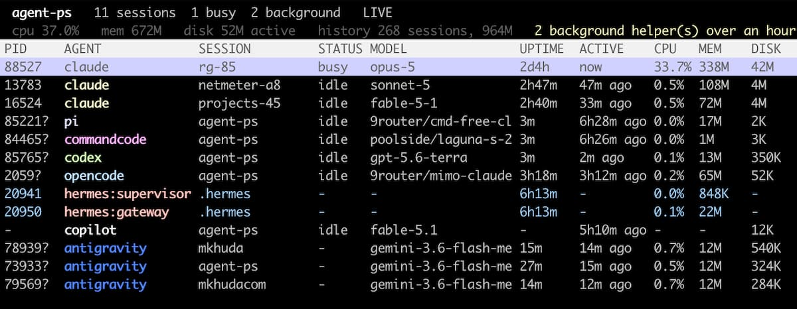
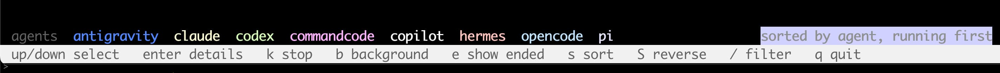

# agent-ps

A process table for coding agent sessions, the way `ps` would look if it knew
what a session was.

[](LICENSE)




`ps aux | grep claude` gives you PIDs. It will not tell you which one is the
session you are talking to, what model it is spending on, whether it has been
idle for three days, or which rows are background daemons that outlived the
terminal that started them. It also misses the other six agents entirely.

agent-ps lists every session with its agent, model, working directory, uptime,
idle time and disk footprint, then stops one process tree, every background
helper, or the lot.

One file, no dependencies, reads local files only.

## Install

```bash
curl -fsSL https://raw.githubusercontent.com/mkhuda/agent-ps/main/install.sh | sh
```

That takes the latest release, checks it against the checksum published with it,
makes sure it runs, and drops the single file into `~/.local/bin`. Set `BIN_DIR`
to put it elsewhere, or `AGENT_PS_REF=v0.1.0` to pin a version.

If you would rather not pipe a script into a shell, the executable is the whole
program and you can fetch it yourself:

```bash
mkdir -p ~/.local/bin
curl -fsSL -o ~/.local/bin/agent-ps \
  https://github.com/mkhuda/agent-ps/releases/latest/download/agent-ps
chmod +x ~/.local/bin/agent-ps
```

Every [release](https://github.com/mkhuda/agent-ps/releases) publishes a
`SHA256SUMS` beside the executable.

If you install your coding agents with npm, `npx agent-ps` works too. It is the
same Python program either way; the package only finds an interpreter.

From a clone, `./install.sh` builds from the tree instead of downloading, so you
install what you are looking at.

Requires Python 3.8 or later and nothing from PyPI. Tested on 3.8, 3.9, 3.10 and
3.14. macOS and Linux; Windows is out because `curses` is not in its standard
library. It shells out to `ps`, and on macOS to `lsof`, which is how a process is
matched to a session everywhere except Claude Code.

To remove it:

```bash
rm -f ~/.local/bin/agent-ps
```

Nothing is written outside that directory. agent-ps only ever reads the agents'
own files.

## Agents

Each agent keeps its own colour in the table, and the same colours label the
legend above the keys.

| Agent | | Sessions in | Paired by | Tokens | Reopened with |
|---|---|---|---|---|---|
| [Claude Code](https://claude.com/claude-code) |  | JSONL | the agent itself | no | `claude --resume` |
| [Pi](https://pi.dev) |  | JSONL | directory | no | `pi --session` |
| CommandCode |  | JSONL | directory | no | `cmd --resume` |
| [Codex CLI](https://github.com/openai/codex) |  | JSONL | directory | no | `codex resume` |
| [OpenCode](https://github.com/sst/opencode) |  | SQLite | directory | yes | `opencode --session` |
| Hermes |  | SQLite | directory | yes | `hermes --resume` |
| GitHub Copilot |  | VS Code storage | no process | yes | in the editor |

Only Claude Code records which process is running which session, so every other
pairing is matched on working directory and shown as a guess. OpenCode, Hermes
and Copilot count tokens and cost, which the detail panel shows. Agents you have
not installed are skipped, not reported as missing.

Copilot is the exception to everything. It runs inside the VS Code extension
host, so it has no process of its own: no PID, no uptime, no CPU or memory, and
nothing to stop. What it does have is the credits each turn spent, which the free
tier meters and nothing else surfaces. A chat counts as open while its workspace
is open in the editor.

## Usage

Run without arguments for the live table:

```bash
agent-ps
```

It refreshes every two seconds and stays out of the way until you act on
something.

| Key | Action |
|---|---|
| up, down | move the selection |
| `j`, `K` | down and up, since `k` is taken by stop |
| home, end | jump to the first or last row |
| enter | details for a live session, or reopen an ended one |
| `s` | cycle the sort column |
| `S` | reverse the direction |
| `k` | stop the selected process and its children, after confirming |
| `b` | stop every background helper, after confirming |
| `y`, `n` | answer a confirmation |
| `e` | show or hide ended sessions |
| `/` | filter by session, title, agent, model, directory, or PID |
| esc | leave filter mode, or close the detail panel |
| space | pause refreshing |
| `r` | refresh now |
| `q` | quit |

Those keys live at the bottom of the screen, under a line naming every agent on
screen in its own colour and, on the right, what the table is sorted by:



That middle line does three jobs. It is the key to the colours in the AGENT
column, it says the sort order in words so the marked heading is never a guess,
and it is where a note appears for a few seconds after you act on something.

Backspacing a filter down to nothing leaves filter mode, so the key bar comes
back without reaching for escape.

### Sorting

`s` cycles the sort column through agent, active, disk, cpu, mem, uptime,
session and title. The sorted heading is marked in place, and the line above the
keys names it in words:

```
PID     AGENT             SESSION         STATUS MODEL               UPTIME  ACTIVE    CPU   MEM    DISKv
31771   claude            benchmark       idle   sonnet-5            54m     54m ago   0.2%  51M    127M
-       claude            web-app         ended  sonnet-5            -       16d8h ago -     -      102M
-       claude            notes           ended  opus-5              -       2h22m ago -     -      84M

 agents  claude  codex  commandcode  copilot  hermes  opencode  pi        sorted by disk, high to low
 up/down select   enter details   k stop   b background   e hide ended   s sort   S reverse   / filter   q quit
```

`v` means descending and `^` ascending; `S` flips it. Numbers start at the
largest, names start at A, and rows with nothing in that column go to the end
either way.

Sorting covers running and ended sessions together, since "which session is the
biggest" does not care whether its process is still alive. Press `e` to include
ended sessions, then `s` until DISK is marked.

### The detail panel

Enter on a live session opens everything known about it, including tokens and
cost where the agent counts them:

```
 session details

       agent  hermes
     session  20260905_005254_2c9f4d
      status  idle
       model  nemotron-3.5-lightning-free
   directory  /Users/rg/projects/agent-ps
       title  halo are you hermes?
         pid  21098  (parent 17518)
      uptime  1h17m   last turn 1h15m ago
       usage  cpu 0.0%   memory 11M   disk 121K
      paired  matched by working directory, not reported
    provider  opencode-free
      tokens  in 24,608  out 242  reasoning 190
       calls  2 api, 6 messages, 0 tool calls
        cost  $0.0000 estimated
     command  /usr/bin/python3 /Users/rg/.hermes/hermes-agent/hermes
```

The `paired` line appears only when the pairing was inferred. The provider,
tokens, calls and cost lines appear only for agents that record them, and are
simply absent for the rest.

Enter on an ended session reopens it in a new terminal tab instead. Copilot
chats live in the editor, so they have no reopen command and say so.

### The advisory line

A line above the keys points out whatever is worth a look: background helpers
left running, sessions untouched for a day, or ended sessions you could resume.
It names the key that acts on it, and only ever shows one thing, since a wall of
warnings teaches people to ignore the line.

## Scripting

```bash
agent-ps list                     # print the table and exit
agent-ps list --all               # include ended sessions
agent-ps list --json              # machine readable, with idle seconds
agent-ps list --limit 100         # how many ended sessions (default 40)
agent-ps list --filter benchmark  # same match as the / key
agent-ps agents                   # which agents were found, and where
agent-ps --agent codex list       # one agent, or a comma separated list
agent-ps stop 32244               # stop one process tree
agent-ps stop 32244 --dry-run     # show what would be stopped
agent-ps stop-background          # stop daemons, warm spares, and servers
agent-ps stop-background --dry-run
agent-ps resume <session>         # a unique id prefix is enough
agent-ps resume <session> --print # print the command instead of running it
agent-ps --version
```

Piping works without a subcommand: with stdout not a terminal, agent-ps prints
the table and exits.

## What each column means

| Column | Meaning |
|---|---|
| PID | the process, or a dash where there is none |
| AGENT | which agent, and what sort of process when it is not a plain session |
| SESSION | the directory the session was started in |
| STATUS | `busy`, `idle`, `ended`, or a dash when nothing says |
| MODEL | what answered the last turn, or the launcher's routing alias |
| UPTIME | how long the process has been alive, from one `ps` call |
| ACTIVE | how long since the session last wrote a turn |
| CPU, MEM | the same `ps` call |
| DISK | everything that session left on disk |
| DIR | the working directory |
| TITLE | the session title, or its opening prompt where the agent keeps none |

UPTIME and ACTIVE often disagree, and that is the point. A process can be five
days old and have answered a minute ago. UPTIME comes from the process table,
ACTIVE from the modification time of the log, which is appended on every turn,
so an ended session shows a dash under UPTIME and only ACTIVE says how stale it
is.

Each agent gets its own colour in the AGENT column, assigned in registry order,
and the same colours appear in the legend, which makes that line the key to the
palette. A selected row keeps its own highlight rather than being broken up, so
the cursor stays unmistakable. Terminals without colour fall back to plain text.

## A PID marked with a question mark

Only Claude Code records which process is running which session, in
`<config dir>/sessions/<pid>.json`. For every other agent the two have to be
matched on working directory, and that cannot tell apart two sessions of the same
agent started in the same folder.

So an inferred pairing is shown as one:

```
32244   claude    form-guardian   idle   opus-5        ...
9666?   codex     agent-ps        idle   gpt-5.6-luna  ...
```

`9666?` means the process is certain and the session beside it is a guess. The
guess is the most recently active session in that directory, and where several
processes of one agent share a directory they are paired newest with newest, so
the process that started four minutes ago gets the session that has been active
for four minutes rather than the one from an hour ago.

It is still a guess, so the stop confirmation names the directory and says when
the pairing was inferred:

```
Stop 1 process(es) in ~/projects/agent-ps, session matched by directory?
```

Where no session matches at all, the row still appears with whatever the process
itself can answer. Nothing is invented to fill the gap.

## How it works

The parts that are not obvious have their own page:
[where each agent keeps its sessions](docs/internals.md), how busy and idle are
decided per agent, which processes count as background helpers, how a shim is
told apart from a real session, and what the DISK column is adding up.

## Stopping behaviour

Processes are stopped depth first, children before parents, so a supervisor does
not restart a worker you just killed. Each process gets `SIGTERM`, one second to
exit, then `SIGKILL` if it is still there.

agent-ps never lists or stops itself, or the shell that launched it, so running
it from inside an agent session is safe.

Exit status is zero when everything asked for was stopped, and one when something
survived, which makes it usable in scripts.

## When something is missing

| Symptom | Cause |
|---|---|
| An agent you use is not listed | agent-ps only looks in the roots above. `agent-ps agents` prints what it found. |
| SESSION and MODEL are dashes on macOS | pairing needs `lsof` to read a process working directory. Linux reads `/proc`. |
| A row paired to the wrong session | see the question mark section above |
| No colour | the terminal reported none, so every row falls back to plain text |
| A Copilot chat has no PID | it never had one. Copilot runs inside VS Code. |

## Build

The executable is a zipapp, built from the package by the standard library:

```bash
./build.sh
```

That writes a single `agent-ps` file with no dependencies, which is what the curl
install fetches. The build is reproducible: the same source always produces the
same bytes, so the committed executable can be checked against the tree.

```
3085afb9b1adaa486ab468066706bb6c5625d06afb18e46fcf97a1e4b8b02c62  agent-ps
```

Adding an agent takes one class and one line in the registry. See
[CONTRIBUTING.md](CONTRIBUTING.md).

## License

MIT. See [LICENSE](LICENSE).
